[README_Version1.md](https://github.com/user-attachments/files/24484894/README_Version1.md)[Uploading REA# 🗳️ Smart Vote Management System - Backend

A robust and secure backend system for managing voter registration applications in India. This system digitizes the voter registration process with role-based access control, supporting multiple application forms (Form 6, 7, and 8) with a multi-tier verification workflow.


## 📋 Table of Contents

- [Features](#-features)
- [Architecture](#-architecture)
- [System Flow](#-system-flow)
- [Tech Stack](#-tech-stack)
- [Getting Started](#-getting-started)
- [API Endpoints](#-api-endpoints)
- [Database Models](#-database-models)
- [Role-Based Access Control](#-role-based-access-control)
- [Application Status Flow](#-application-status-flow)
- [Environment Variables](#-environment-variables)
- [Contributing](#-contributing)

## ✨ Features

### 🎯 Core Functionality
- **Multi-Form Support**:  Handles Form 6 (New Registration), Form 7 (Deletion), and Form 8 (Correction)
- **Role-Based Access Control**: Four distinct user roles (VOTER, BLO, ERO, RO)
- **Multi-Tier Verification**: BLO verification followed by ERO approval
- **Duplicate Detection**: Smart duplicate detection at ERO, DEO, and CEO levels
- **Audit Trail**: Complete audit logging for all actions and status changes
- **Jurisdiction Management**: State, District, Assembly Constituency, and Booth level management
- **Form Validation**: Robust validation rules for each form type
- **Status Flow Management**: Enforced status transition rules based on user roles

### 🔒 Security Features
- JWT-based authentication
- Password hashing with bcrypt
- Role-based authorization middleware
- Protected routes

## 🛠️ Tech Stack

| Technology | Purpose |
|------------|---------|
| **Node.js** | Runtime environment |
| **Express. js** | Web application framework |
| **MongoDB** | NoSQL database |
| **Mongoose** | MongoDB ODM |
| **JWT** | Authentication tokens |
| **bcryptjs** | Password hashing |
| **dotenv** | Environment configuration |

## 🚀 Getting Started

### Prerequisites

- Node.js (v18 or higher)
- MongoDB (v6 or higher)
- npm or yarn

### Installation

1. **Clone the repository**
   ```bash
   git clone https://github.com/kumamihir/SMART_VOTE_MANAGMENT_BACKEND. git
   cd SMART_VOTE_MANAGMENT_BACKEND/VoteM_Backend
   ```

2. **Install dependencies**
   ```bash
   npm install
   ```

3. **Set up environment variables**
   
   Create a `.env` file in the root directory:
   ```env
   PORT=3000
   MONGO=mongodb://localhost:27017/vote_management
   JWT_SECRET=your_super_secret_jwt_key_here
   JWT_EXPIRE=7d
   ```

4. **Start the server**
   
   **Development mode:**
   ```bash
   npm run dev
   ```
   
   **Production mode:**
   ```bash
   npm start
   ```

The server will start on `http://localhost:3000` 🎉

## 📡 API Endpoints

### 🔐 Authentication Routes (`/api/auth`)

| Method | Endpoint | Description | Access |
|--------|----------|-------------|--------|
| POST | `/api/auth/register` | Register new user | Public |
| POST | `/api/auth/login` | Login user | Public |

### 👥 Voter Routes (`/api/voter`)

| Method | Endpoint | Description | Access |
|--------|----------|-------------|--------|
| POST | `/api/voter/apply` | Submit voter application | VOTER |

### 👨‍💼 BLO Routes (`/api/blo`)

| Method | Endpoint | Description | Access |
|--------|----------|-------------|--------|
| GET | `/api/blo/applications` | Get pending applications | BLO |
| GET | `/api/blo/stats` | Get BLO statistics | BLO |
| POST | `/api/blo/verify` | Verify application | BLO |

### 👨‍⚖️ ERO Routes (`/api/ero`)

| Method | Endpoint | Description | Access |
|--------|----------|-------------|--------|
| GET | `/api/ero/applications` | Get verified applications | ERO |
| GET | `/api/ero/stats` | Get ERO statistics | ERO |
| POST | `/api/ero/process` | Process (approve/reject) application | ERO |

### 📋 Audit Routes (`/api/audit`)

| Method | Endpoint | Description | Access |
|--------|----------|-------------|--------|
| GET | `/api/audit/:applicationId` | Get audit trail for application | BLO, ERO, DEO, CEO |

### 📦 Archive Routes (`/api/archive`)

| Method | Endpoint | Description | Access |
|--------|----------|-------------|--------|
| POST | `/api/archive` | Archive application | ERO, DEO, CEO |

## 🗄️ Database Models

### User Model

```javascript
{
  name: String,
  email: String (unique),
  passwordHash: String,
  role:  Enum ["VOTER", "BLO", "ERO", "RO"],
  jurisdiction: {
    state: String,
    district: String,
    assembly:  String,
    booth: String
  },
  timestamps: true
}
```

### Voter Application Model

```javascript
{
  applicant: ObjectId (ref: User),
  formType: Enum ["FORM_6", "FORM_7", "FORM_8"],
  address: String,
  boothId: String,
  assemblyConstituencyId: String,
  formData: Mixed,
  districtId: String,
  stateId: String,
  status:  Enum ["DRAFT", "PENDING_BLO", "BLO_VERIFIED", 
                "ERO_APPROVED", "REJECTED", "ARCHIVED"],
  assignedBLO: ObjectId (ref: User),
  verifiedBLO: ObjectId (ref: User),
  verifiedAt: Date,
  isDuplicate: Boolean,
  remarks: String,
  rejectionReason: String,
  auditTrail: Array,
  timestamps: true
}
```

### Audit Log Model

```javascript
{
  application: ObjectId (ref: VoterApplication),
  performedBy: ObjectId (ref:  User),
  role: Enum ["Voter", "BLO", "ERO", "DEO", "CEO"],
  action: String,
  remarks: String,
  timestamps: true
}
```

## 👮 Role-Based Access Control


### Role Hierarchy

| Role | Full Name | Permissions |
|------|-----------|-------------|
| **VOTER** | Voter/Citizen | Submit applications (Form 6, 7, 8) |
| **BLO** | Booth Level Officer | Verify applications at booth level |
| **ERO** | Electoral Registration Officer | Approve/reject verified applications, detect duplicates |
| **RO** | Returning Officer | View and generate reports |

## 🔀 Application Status Flow

```mermaid
stateDiagram-v2
    [*] --> DRAFT:  Voter starts application
    DRAFT --> PENDING_BLO:  Voter submits
    
    PENDING_BLO --> BLO_VERIFIED: BLO verifies ✓
    PENDING_BLO --> REJECTED: BLO rejects ✗
    
    BLO_VERIFIED --> ERO_APPROVED: ERO approves ✓
    BLO_VERIFIED --> REJECTED: ERO rejects ✗
    
    ERO_APPROVED --> ARCHIVED: System archives
    REJECTED --> ARCHIVED: System archives
    
    ARCHIVED --> [*]
    
    note right of PENDING_BLO
        BLO can transition to: 
        - BLO_VERIFIED
        - REJECTED
    end note
    
    note right of BLO_VERIFIED
        ERO can transition to:
        - ERO_APPROVED
        - REJECTED
    end note
```



### Status Transition Rules

```javascript
STATUS_FLOW = {
  PENDING_BLO: {
    allowedRoles: ["BLO"],
    next: ["BLO_VERIFIED", "REJECTED"]
  },
  BLO_VERIFIED:  {
    allowedRoles:  ["ERO"],
    next:  ["ERO_APPROVED", "REJECTED"]
  },
  ERO_APPROVED: {
    allowedRoles: ["SYSTEM", "ERO", "DEO", "CEO"],
    next: ["ARCHIVED"]
  },
  REJECTED: {
    allowedRoles: ["SYSTEM", "ERO", "DEO", "CEO"],
    next: ["ARCHIVED"]
  }
}
```

## 📋 Form Types & Validation

### Form 6 - New Voter Registration

**Required Fields:**
- `fullName`, `dob`, `gender`
- `address`, `stateId`, `districtId`
- `assemblyConstituencyId`, `boothId`
- `email`, `mobile`

### Form 7 - Voter Deletion Request

**Required Fields:**
- `reason`, `existingVoterId`
- `address`, `stateId`, `districtId`
- `assemblyConstituencyId`

### Form 8 - Voter Information Correction

**Required Fields:**
- `existingVoterId`, `fieldsToUpdate`
- `address`, `stateId`, `districtId`
- `assemblyConstituencyId`

## 🔍 Duplicate Detection

The system performs intelligent duplicate detection at multiple levels:


## 🌍 Environment Variables

| Variable | Description | Example |
|----------|-------------|---------|
| `PORT` | Server port | `3000` |
| `MONGO` | MongoDB connection string | `mongodb://localhost:27017/vote_db` |
| `JWT_SECRET` | Secret key for JWT | `your_secret_key` |
| `JWT_EXPIRE` | JWT expiration time | `7d` |

## 📁 Project Structure

```
SMART_VOTE_MANAGMENT_BACKEND/
└── VoteM_Backend/
    ├── src/
    │   ├── app.js                          # Express app entry point
    │   ├── config/
    │   │   └── db.js                       # MongoDB connection
    │   ├── controllers/
    │   │   ├── auth.controller.js          # Authentication logic
    │   │   ├── voterApplication.controller.js
    │   │   ├── blo.controller.js
    │   │   ├── ero.controller.js
    │   │   ├── audit.controller.js
    │   │   └── archive.controller.js
    │   ├── middleware/
    │   │   ├── auth. middleware.js          # JWT verification
    │   │   ├── role.middleware.js          # Role authorization
    │   │   └── authorizeRoles.js
    │   ├── models/
    │   │   ├── user.js                     # User schema
    │   │   ├── voterApplication.js         # Application schema
    │   │   └── auditLog.js                 # Audit log schema
    │   ├── routes/
    │   │   ├── auth.routes.js
    │   │   ├── voterApplication.routes.js
    │   │   ├── blo.routes.js
    │   │   ├── ero.routes.js
    │   │   ├── audit.routes.js
    │   │   └── archive.routes.js
    │   └── utils/
    │       ├── formValidator.js            # Form validation rules
    │       ├── statusflow.js               # Status transition logic
    │       ├── duplicateDetector.js        # Duplicate detection
    │       └── auditLogger.js              # Audit logging utility
    ├── package.json
    └── .env
```

## 🧪 Testing

```bash
# Run tests (when implemented)
npm test

# Run tests with coverage
npm run test:coverage
```

## 🤝 Contributing

Contributions are welcome! Please follow these steps:

1. Fork the repository
2. Create a feature branch (`git checkout -b feature/AmazingFeature`)
3. Commit your changes (`git commit -m 'Add some AmazingFeature'`)
4. Push to the branch (`git push origin feature/AmazingFeature`)
5. Open a Pull Request

## 📝 License

This project is licensed under the ISC License.

## 👨‍💻 Author

**Kumamihir**
- GitHub: [@kumamihir](https://github.com/kumamihir)

## 🙏 Acknowledgments

- Election Commission of India for the voter registration process guidelines
- Express.js community for excellent documentation
- MongoDB team for the robust database solution

---

<div align="center">
  <strong>Built with ❤️ for democratic participation</strong>
  <br>
  <sub>Making voter registration accessible and transparent</sub>
</div>DME_Version1.md…]()
